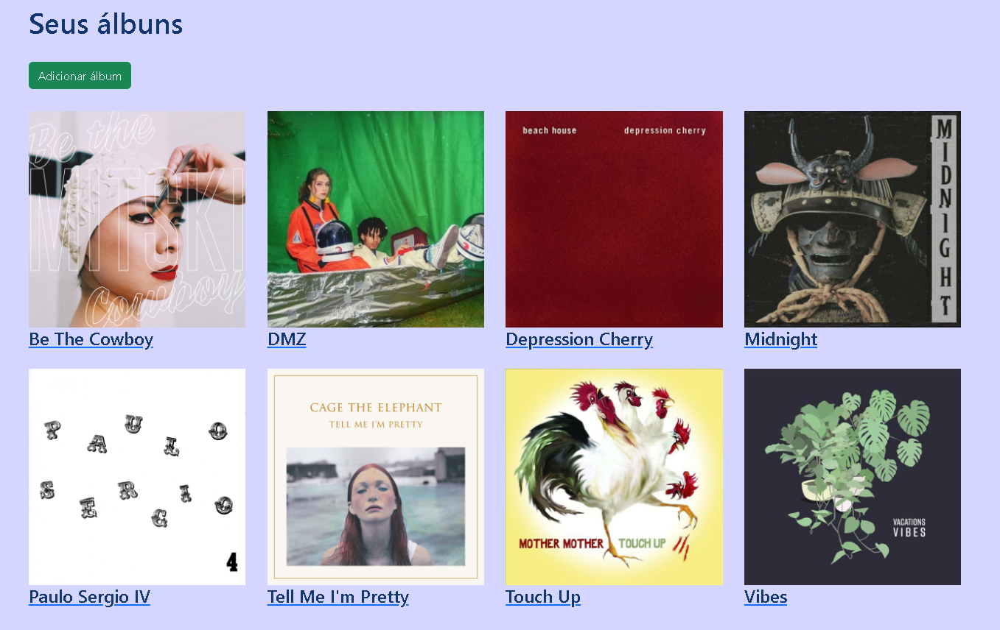
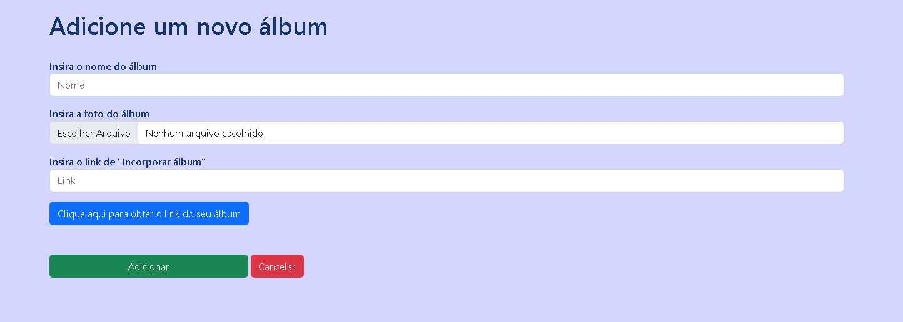

# PROJETO MP3

<h2>Tela inicial</h2>

  

<h2>Formulário para inserção de um novo álbum</h2>

  

<h2>Obtendo o link do frame para criação do álbum</h2>

  

## Índice
* [Introdução](#%EF%B8%8F-introdução)
* [Tecnologias utilizadas](#%EF%B8%8F-tecnologias-utilizadas)
* [Ferramentas utilizadas](#%EF%B8%8F-ferramentas-utilizadas)
* [Serviços utilizados](#-serviços-utilizados)
* [Funcionalidades do projeto](#-funcionalidades-do-projeto)
* [Acesso ao projeto](#-acesso-ao-projeto)
* [Autor](#-autor)
* [Contato](#%EF%B8%8F-contato)

## ⚙️ Introdução

O projeto MP3 é um sistema de exibição de álbuns dinâmico que permite a adição de novos álbuns. O sistema foi desenvolvido utilizando HTML, CSS, PHP e [outras ferramentas e tecnologias](#%EF%B8%8F-tecnologias-utilizadas)

## 🖥️ Tecnologias utilizadas

- ``HTML``
- ``CSS``
- ``PHP``
- ``BootStrap``
- ``Laradock``

## 🛠️ Ferramentas utilizadas

- ``PhpStorm``
- ``Docker``

## 🧰 Serviços utilizados

- ``GitHub``

## 🪚 Funcionalidades do projeto

- ``Funcionalidade 1:`` Visualização dinâmica e responsiva dos álbuns do usuário
- ``Funcionalidade 2:`` Adição de novos álbuns
- ``Funcionalidade 3:`` Sistema de obtenção de link de álbum para a criação de novos álbuns
- ``Funcionalidade 4`` Navegação entre páginas
- ``Funcionalidade 5 (Sistema interno):`` Manipulação de arquivos e diretórios

## 📂 Acesso ao projeto

Você pode acessar o projeto [via link](https://projeto-mp3-php.gustavoborges8.repl.co) ou [baixando-o]() e iniciando-o na IDE de sua preferência, onde quando executado irá abrir no navegador o projeto funcionando.

## 👤 Autor

| [ Gustavo Casagrande Borges](https://github.com/gustavotht21) |
|:---:| 

## ✉️ Contato

Entre em contato via e-mail: borges.gustavo@estudante.ifro.edu.br
